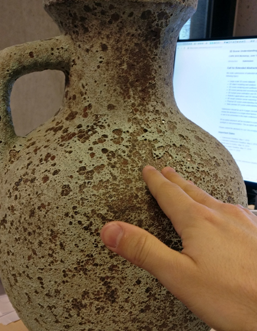

# VR-Vibrotactile-Haptics
A project for testing using the vibro motors in the HTC Vive controller to reproduce surface roughness feeling for in air haptics.

The project is based on the paper, published in VISIGRAPP 2020 - [Preliminary Study on the Use of Off-the-Shelf VR Controllers for Vibrotactile Differentiation of Levels of Roughness on Meshes](https://www.scitepress.org/Link.aspx?doi=10.5220%2f0009101303340340)

# Prerequisites

1. The Unity Engine updated to version 2019.3.7f1 or higher
2. A HTC Vive with two controllers 
3. Setting up the controller button interactions, as the one given in the project

# How to use and modify

The project contains a main scene with two sets of object hierarchies - StartZone and TestZone. The two can be toggled with between by pressing the Spacebar. We recommend to start of with the StartZone, to get used to the vibrotactile sensation, combined with actually seeing the rough surface of the object.

The is a virtual stylus connected to the right controller representation in VR. If a user touches and moves the stylus on the surface of the objects, while putting a finger on the touchpad of the controller, the vibrotactile feedback will be triggered. 

To change the haptic respose from the object surface, please look at the Manager object. In the script "Normal Value Capture", a number of values can be changed from the inspector:

1. Frequency High and Amplitude High - changing the vibrational respose, when a large roughness has been detected on the surface of the mesh
2. Duration High - how long the vibrational signal should be - if value is too low, the vibrational motor will only produce noise,as it will not have time to do a full vibrational cycle
3. Frequency Low, Amplitude Low, Duration Low - changing the vibrational response, when a small roughness has been detected on the surface - it has to be smaller then the High responses
4. Min Movement - a low-pass filter cutting off the vibrational response for very small mevements, so the noise in the controller is minimized. The higher the threshold is only bigger movements will be translated to vibrational feedback
5. Multiplier - used to change the full vibrational response - high and low quickly. Used for testing

A second script is present in the Manager object called - "Texture Value Capture", this script is initial test variation, used for gathering roughness values not from the normals of the object, but from the texture variation. 

 

# Additional Stuff
The repo contains a number of 3D reconstructed objects for testing that can be swapped to see difference in their roughness profile. The object should contain a mesh collider to function. Custom objects can be imported and tested.

Some of the objects contain a ColorByNormal surface shader, used for testing purposes - looking how the normals of different surface roughnesses change.

The application was build together with **Jens Stokholm Høngaard** and uses code ideas presented in the paper: [Difference of Normals as a Multi-Scale Operator in Unorganized Point Clouds](https://arxiv.org/abs/1209.1759#:~:text=The%20Difference%20of%20Normals%20(DoN,is%20quantitatively%20and%20qualitatively%20demonstrated)

